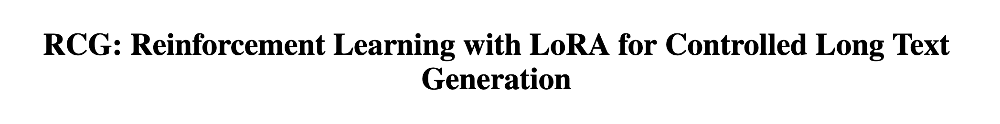
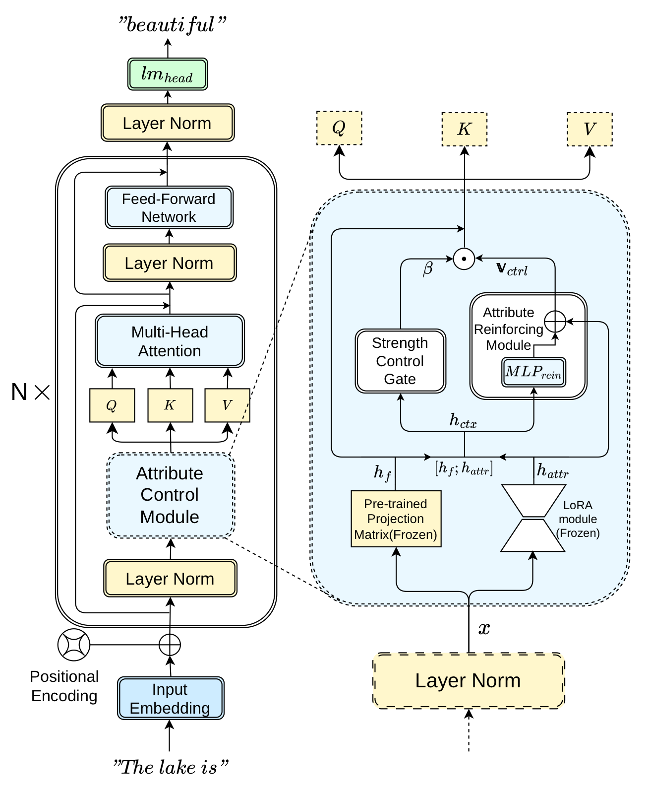
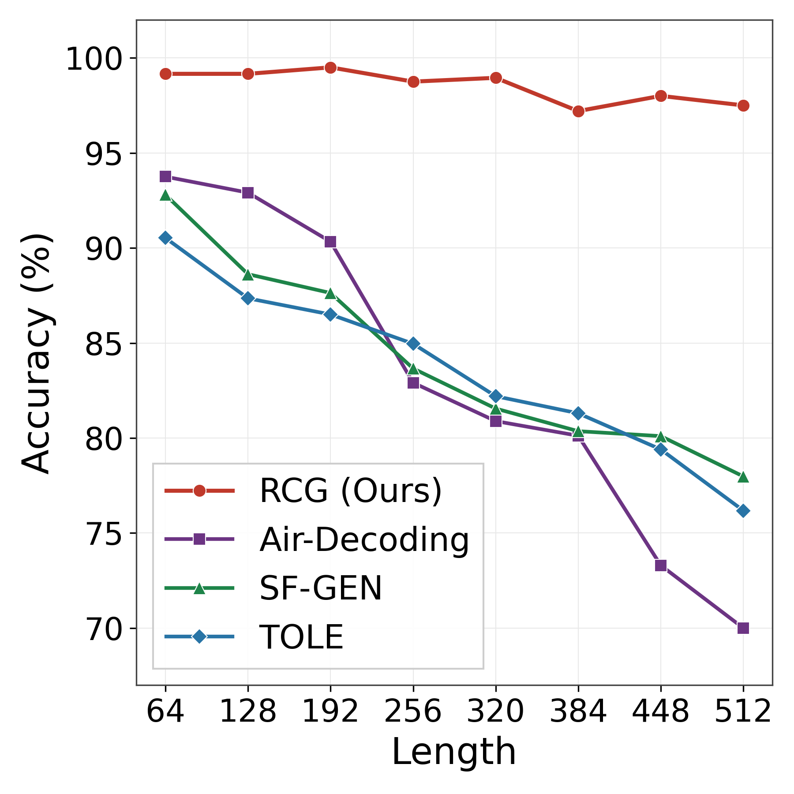
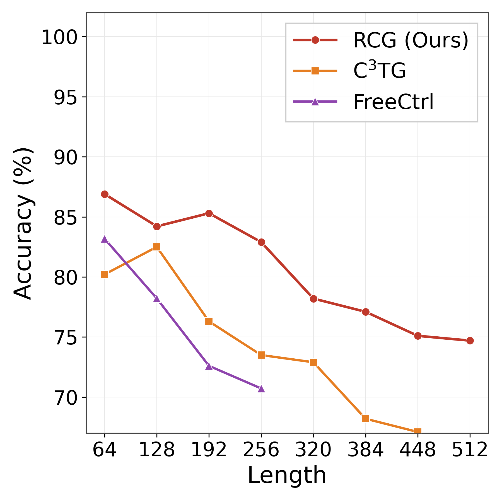

# RCG: Reinforcement Learning with LoRA for Controlled Long-Text Generation

<div align="center">

</div>

<p align="center">
  <a href="https://www.python.org/"></a>
  <a href="https://pytorch.org/"></a>
  <a href="https://huggingface.co/docs/peft"></a>
  <a href="#license"></a>
  
</p>

> :warning: **Submission notice** — The paper accompanying this repository is **currently under review** at a peer-reviewed venue. The code, datasets, and pre-computed results are released to support reproducibility; please refer to the paper for the full methodology and analysis.

This repository provides the official implementation of **RCG**, an efficient framework for **controlled long-text generation** (CLTG). RCG combines **attribute LoRA modules**, a lightweight **fusion-and-gating policy**, and **reinforcement learning (PPO)** to keep a generated sequence faithful to a desired attribute (e.g., positive sentiment, a specific topic, or low toxicity) over long horizons — without the fluency collapse and repetition that plague prior decoding-time methods.

---

## Abstract

Controlled text generation has achieved strong performance on short texts, yet attribute control degrades markedly as generation length increases: the target attribute drifts, and existing decoding-time approaches compensate by increasing control strength, which in turn corrupts the output distribution (degeneration, repetition, poor fluency). We propose **RCG**, a lightweight yet effective framework for controlled **long**-text generation that combines three ideas: **(i)** per-attribute low-rank adapters (LoRA) trained on the attention projection matrix, which provide explicit, parameter-efficient attribute representations; **(ii)** a per-layer fusion-and-gating policy that learns both *where* to steer the hidden representation and *how strongly* to steer it based on the current context; and **(iii)** reinforcement-learning alignment with a carefully designed reward that balances attribute score, reference-model guidance, repetition penalty, and exploration noise. Experiments on sentiment control (IMDB/SST-2), topic control (AG-News), and detoxification (Jigsaw) demonstrate that RCG maintains high attribute accuracy and low perplexity across generation lengths of 64–512 tokens, with short RL training (tens of epochs) and a tiny number of trainable parameters.

---

## Highlights

- **Parameter-efficient**: RCG freezes the base GPT-2 and the attribute LoRA bank; only the small fusion-and-gating policy and the critic head are trained by RL.
- **Cheap RL**: tens of PPO epochs suffice — a single trained policy generalizes across generation lengths (64–512 tokens).
- **Stable attribute control over long text**: accuracy stays high as length grows, without the attribute-collapse and repetition typical of decoding-time methods.
- **Flexible gating**: when the attribute is already satisfied, the gate emits a small control strength and lets the base model generate fluently; when it is not, the gate increases steering to guide the generation.
- **Weak backbone by design**: GPT-2 is chosen deliberately to show that effective control can be achieved even on a relatively weak base model.

---

## Overview



RCG plugs a per-layer policy into the attention projection (`c_attn`) of a frozen GPT-2. For every attribute we first train an independent LoRA adapter on `c_attn`. At each layer, the base output and the active adapter outputs are concatenated and fed to the policy, which consists of:

1. a **fusion network** that computes the direction of the hidden-state offset, initialized so that its output is a residual on top of the attribute-direction signal (e.g., `pos − neg`), and
2. a **gating network** that outputs a scalar control strength $\alpha \in (0,1)$ conditioned on the current context.

The final `c_attn` output is
$$\text{out} = \text{base} + \alpha \cdot \text{direction}.$$

The policy is trained by proximal policy optimization (PPO) with a composite reward (see below).

---

## Tasks

| Task | Attribute space | Reward model | Dataset |
|------|-----------------|--------------|---------|
| Sentiment control | `pos` / `neg` | GPT-2 fine-tuned on SST-2 | IMDB |
| Topic control | `world` / `sports` / `business` / `science` | RoBERTa fine-tuned on AG-News | AG-News |
| Detoxification | `nontoxic` | Unbiased Toxic RoBERTa | Jigsaw |

For sentiment and topic, accuracy (**ACC**) is the fraction of generated sequences classified as the target attribute; for detoxification, **toxicity** (TOX) is the mean toxicity probability. Fluency is measured with **perplexity** (PPL) under the frozen GPT-2, and diversity with **Dist-1/2/3**. We additionally report **LLM-as-judge** evaluations using Qwen3-8B.

---

## Results

The figures below compare RCG against baselines (including decoding-time steering) on long-text generation. RCG keeps the target attribute aligned over the full sequence while remaining fluent and diverse.

<p align="center">
  
  
</p>

Representative results (attribute accuracy / toxicity and perplexity across lengths) are summarized below; the full tables and ablations are in the paper.

<details>
<summary><b>Sentiment control</b> (click to expand)</summary>

| Length | pos ACC | pos PPL | neg ACC | neg PPL |
|-------:|--------:|--------:|--------:|--------:|
| 64  | 99.17 | 17.45 | 98.75 | 18.04 |
| 128 | 99.58 | 14.99 | 99.58 | 14.35 |
| 256 | 97.92 | 13.08 | 100.0 | 12.12 |
| 512 | 97.50 | 12.41 | 97.08 | 10.58 |

</details>

<details>
<summary><b>Topic control</b> (click to expand)</summary>

| Length | world | sports | business | science |
|-------:|------:|-------:|---------:|--------:|
| 64  | 96.56 / 18.77 | 99.69 / 18.29 | 98.75 / 17.93 | 98.44 / 20.24 |
| 128 | 100.0 / 15.17 | 100.0 / 13.73 | 99.69 / 14.04 | 98.75 / 14.94 |
| 256 | 97.50 / 12.90 | 100.0 / 11.24 | 99.69 / 11.77 | 98.44 / 12.17 |
| 512 | — | 99.69 / 10.09 | 99.38 / 10.71 | 99.38 / 10.55 |

*(reported as ACC / PPL)*

</details>

<details>
<summary><b>Detoxification</b> (click to expand)</summary>

| Length | TOX | PPL |
|-------:|----:|----:|
| 64  | 30.88 | 15.14 |
| 128 | 27.37 | 9.91  |
| 256 | 21.81 | 7.55  |
| 512 | 20.56 | 6.39  |

</details>

---

## Repository Structure

```
RCG/
├── assets/                      # figures used in the README / paper
│   ├── title.png
│   ├── method_overview.png
│   ├── final_frame_work3_cropped.pdf
│   ├── fig1_single_test.png
│   └── fig1_multi_test.png
├── dataset/                     # datasets for the three tasks
│   ├── sentiment-imdb/
│   ├── topic-agnews/
│   └── detoxification-jigsaw/
├── gen_eval/                    # per-task generation & evaluation
│   ├── sentiment_gen_eval.py
│   ├── topic_gen_eval.py
│   ├── detoxification_gen_eval.py
│   └── utils.py                 # metrics: PPL / ACC / TOX / Dist-n
├── model_utils/
│   └── model.py                 # FusionPolicy, LayerController, Critic
├── utils/
│   ├── Agent.py                 # RL agent: rollout, reward, PPO update
│   └── utils.py                 # LoRA loading, policy injection, reward fn
├── scripts/
│   ├── rl_train.sh              # launch RL training for all attributes
│   └── gen_eval.sh              # launch generation & evaluation
├── distil_test/                 # distilled-model experiments (auxiliary)
├── train_lora.py                # stage 1: train per-attribute LoRA modules
├── rl_train.py                  # stage 2: train the fusion-and-gating policy (PPO)
├── generation_eval.py           # evaluate a trained policy
├── air_lora_gen_test.py         # Air-decoding baseline with LoRA replaced for prefix
├── llm_as_judge.py              # LLM-as-judge evaluation (Qwen3-8B)
└── requirements.txt
```

---

## Setup

### 1. Install dependencies

```bash
pip install -r requirements.txt
```

Core libraries: `torch`, `transformers`, `peft`, `numpy`, `tqdm`, `tensorboard`. `openai` is only needed for the optional `llm_as_judge.py` evaluation.

### 2. Prepare base and reward models

RCG requires the following pretrained models (all paths are hard-coded in the scripts and **must be updated to your local paths**):

| Model | Role |
|-------|------|
| `gpt2-medium` | base generative model and reference model |
| `gpt2-medium-finetuned-sst2-sentiment` | sentiment reward model |
| `roberta-based-ag-news` | topic reward model |
| `unbiased-toxic-roberta` | toxicity reward model |

These are all standard models available from Hugging Face, except the sentiment classifier, which is a GPT-2 fine-tuned on SST-2 (any equivalent sentiment classifier works).

### 3. Configure paths

The repository was developed with absolute paths under `/home/anke/DXZ/`. Before running, update the model paths and dataset paths in:

- `train_lora.py` (`model_path`, `dataset_path`, reward-model paths)
- `utils/utils.py` (`c_attn_lora_method.gpt_path`)
- `utils/Agent.py` (reward-model paths and prompt paths)
- `rl_train.py` and `generation_eval.py` (`lora_path_dict`)

---

## Quick Start

RCG is trained in two stages. All commands below assume the paths above have been configured.

### Stage 1 — Train per-attribute LoRA modules

```bash
python train_lora.py
```

This trains an independent LoRA adapter (`r=8`, `alpha=16`, target `c_attn`) for each attribute on its own attribute dataset, and saves the adapters under `lora_train/`.

### Stage 2 — Train the fusion-and-gating policy with PPO

```bash
python rl_train.py --task sentiment --attr pos --version v1
python rl_train.py --task topic    --attr world --version v1
python rl_train.py --task detoxification --attr nontoxic --version v1
```

The policy (fusion network + gating network) and the critic are trained by PPO over token-level rollouts, with GAE for advantage estimation. Checkpoints are saved under `rl_train/<task>/<attr>/<version>/checkpoints/`.

> A helper that launches training across all attributes is provided in `scripts/rl_train.sh`.

### Evaluation

```bash
python generation_eval.py \
    --args_path   rl_train/sentiment/pos/v1/hyper_params.json \
    --policy_path rl_train/sentiment/pos/v1/checkpoints/<ckpt> \
    --batch_size 16 --num_sequence 16 --generate_length 128
```

This reports attribute accuracy (or toxicity), perplexity, and Dist-1/2/3. See `scripts/gen_eval.sh` for the full sweep over lengths `{64, 128, 256, 512}`.

---

## Reward Design

The RL objective uses a composite token-level reward:

$$\text{reward} = \tanh\big(\lambda_a \cdot \text{attr}\big) + \lambda_b \cdot \log p_{\text{ref}}(y_t \mid y_{<t}) - \lambda_r \cdot \text{rep} + \text{noise}$$

- **Attribute reward** — the score of the full prefix under the task's reward model; higher when the generated text matches the target attribute.
- **Reference-model guidance** — the log-probability of the sampled token under a frozen GPT-2; it keeps the policy close to the base distribution and prevents grammatical errors.
- **Repetition penalty** — the bigram repetition rate, encouraging diversity.
- **Exploration noise** — zero-mean Gaussian noise that decays over steps, replacing an explicit KL term.

This reward lets the policy learn to steer *only when needed*: once the attribute is satisfied, optimizing the reference-model term drives the gate toward a small control strength, yielding fluent continuations.

---

